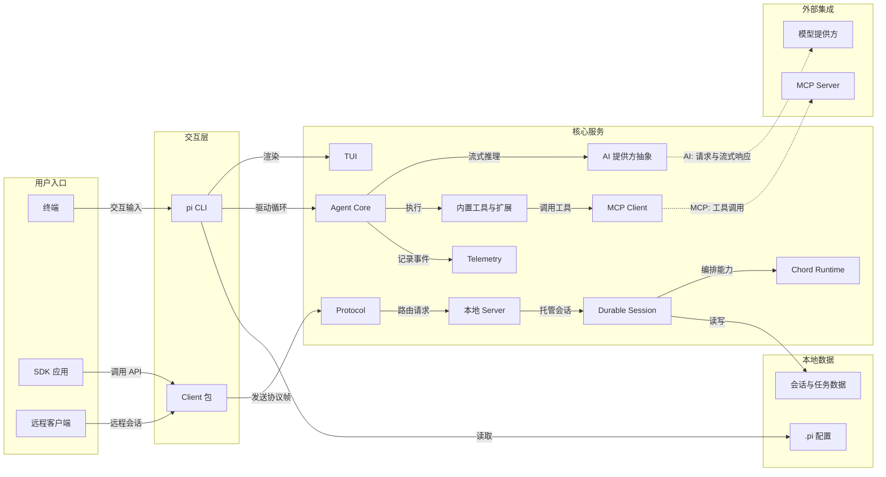
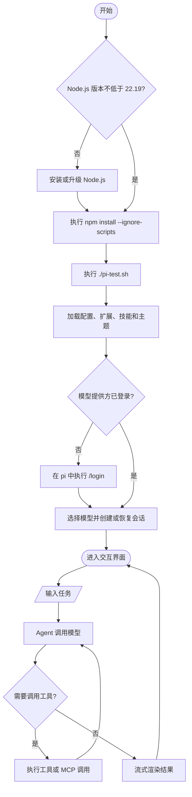

# jonwork-pi 架构与使用手册

## 项目定位

`jonwork-pi` 是 Jonwork 维护的 Pi 源码仓库。仓库名和根工作区名使用 `jonwork-pi`；为了兼容已有用户、配置和 npm 包，命令名 `pi`、配置目录 `.pi` 以及 `@earendil-works/pi-*` 包名保持不变。

运行环境要求：

- Node.js 22.19 或更高版本
- npm
- 至少一个已配置的模型提供方登录或 API 密钥

## 架构组件



主要组件职责：

| 组件 | 目录 | 职责 |
|---|---|---|
| Coding Agent | `packages/coding-agent` | `pi` 命令、交互循环、工具、扩展、会话管理 |
| Agent Core | `packages/agent` | 消息状态、模型调用、工具调用与事件流 |
| AI | `packages/ai` | 多模型提供方、鉴权、流式响应、用量统计 |
| TUI | `packages/tui` | 终端渲染与输入组件 |
| MCP | `packages/mcp` | stdio/HTTP MCP 客户端与 OAuth |
| Durable | `packages/durable` | 持久会话、任务和文档运行时 |
| Protocol / Client / Server | `packages/protocol`、`packages/client`、`packages/server` | CBOR 协议、远程客户端和本地会话路由 |
| Chord | `packages/chord` | 服务组合、复制状态、RPC 与插件运行时 |
| Telemetry | `packages/telemetry` | 厂商无关的遥测契约和类型 |

## 启动流程



## 首次安装与启动

在仓库根目录执行：

```bash
node --version
npm install --ignore-scripts
./pi-test.sh
```

`./pi-test.sh` 直接从当前源码启动 CLI，适合开发和验收。首次进入后执行 `/login`，选择模型提供方并完成登录，然后输入任务即可。

如需使用已发布版本：

```bash
npm install -g --ignore-scripts @earendil-works/pi-coding-agent
pi
```

## 常用操作

| 目标 | 命令 |
|---|---|
| 从源码启动 | `./pi-test.sh` |
| 检查代码 | `npm run check` |
| 运行非端到端测试 | `./test.sh` |
| 离线构建 | `npm run build:offline` |
| 查看 CLI 参数 | `./pi-test.sh --help` |
| 在交互界面登录 | `/login` |
| 退出交互界面 | `/exit` 或 `Ctrl+C` |

## 配置与扩展

Pi 从用户配置目录和项目内的 `.pi` 目录加载配置。常用扩展点：

- 扩展：`packages/coding-agent/docs/extensions.md`
- 技能：`packages/coding-agent/docs/skills.md`
- 提示词模板：`packages/coding-agent/docs/prompt-templates.md`
- 主题：`packages/coding-agent/docs/themes.md`
- CLI 自动化：`packages/coding-agent/docs/cli.md`
- RPC 控制：`packages/coding-agent/docs/rpc.md`
- TypeScript SDK：`packages/coding-agent/docs/sdk.md`

配置和凭据不要提交到 Git。使用项目级配置前，先检查其权限范围和工具命令。

## 停止与重新启动

前台运行时，先在交互界面执行 `/exit`，或按 `Ctrl+C` 停止，再重新运行：

```bash
./pi-test.sh
```

如果 Pi 由终端复用器或进程管理器托管，应在原托管会话中停止旧进程并启动新进程，避免产生多个会话同时写入同一状态目录。

## 验证与故障排查

1. `node --version` 应满足最低版本要求。
2. `npm install --ignore-scripts` 应正常完成，且不执行依赖生命周期脚本。
3. `./pi-test.sh --help` 应输出 CLI 帮助。
4. 交互启动后应能完成 `/login`、选择模型、发送消息和退出。
5. 若启动失败，先检查终端错误、Node.js 版本、依赖安装状态和模型凭据。
6. 若工具不可用，检查扩展配置、MCP 服务器命令和进程权限。

项目默认直接继承当前用户的文件系统、进程、网络和凭据权限。需要更强隔离时，参考 `packages/coding-agent/docs/containerization.md` 使用容器或沙箱。

## 更新与回滚

更新前记录当前提交：

```bash
git rev-parse HEAD
```

更新后执行 `npm run check` 和必要的专项测试，再重启 CLI。若新提交导致问题，保留工作区变更，切换回已验证提交或通过新的回滚提交恢复；不要对共享工作区使用破坏性的重置命令。
