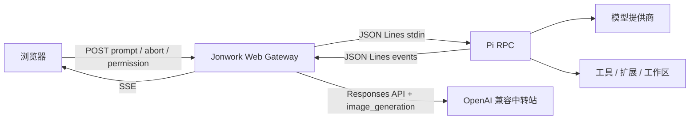
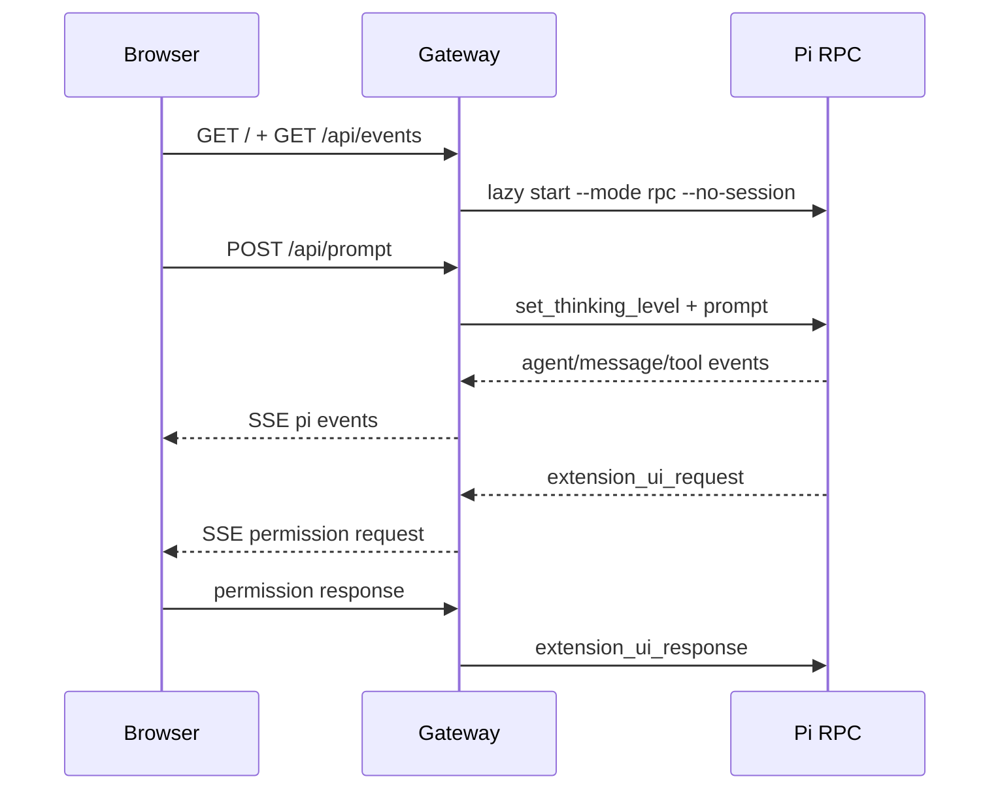

# Jonwork Pi Web

Jonwork 的浏览器端 Pi 工作台。浏览器只连接同源 Node 网关；网关以 RPC 模式启动 Pi，并把事件通过 SSE 实时推送到界面。

## 架构



## 启动流程



## 本地使用

```bash
npm install --ignore-scripts
npm run build
npm run dev --workspace=@jonwork/pi-web -- --host 127.0.0.1 --port 4318
```

打开 <http://127.0.0.1:4318>。默认仅监听本机；仅在受控网络或反向代理后显式使用 `--host 0.0.0.0`。生产部署应在网关前增加 TLS、企业身份认证、审计日志和限流。

### 功能

- 真实 Pi 对话流、停止任务、深度思考和模型状态
- Pi 扩展确认、选择、输入与编辑请求回执
- PNG/JPEG/WebP 图片附件（最多 4 张、单请求总计 5 MB）
- 语音输入（取决于浏览器 Web Speech 支持）
- 结果大图、分享链接、建议快捷指令
- Pi CLI 尚未构建或不可用时拒绝任务，不返回任何模拟结果

默认身份是“本地用户 / 未登录”。它不是企业账号，也不会伪造用户资料；接入企业 SSO 后应由认证会话覆盖该显示。

图像产出必须来自当前会话中的真实 Pi 图像工具调用。当前 Pi 图像模型通过 OpenRouter 提供；配置 `OPENROUTER_API_KEY` 或完成 Pi 的 OpenRouter 登录后，设计请求可使用 `codemode` 生成图片。未配置时界面会明确显示能力不可用，不会使用样例图替代。

也可以通过服务端环境变量接入支持 Responses API `image_generation` 工具的 OpenAI 兼容中转站。密钥只允许注入服务端环境，不得写入前端、仓库或日志：

```bash
export JONWORK_API_BASE_URL="https://newapi.rivarouter.com/v1"
export JONWORK_API_KEY="由部署平台注入的密钥"
export JONWORK_CHAT_MODEL="gpt-6.1-sol"
export JONWORK_IMAGE_MODEL="gpt-image-2"
npm run start --workspace=@jonwork/pi-web -- --host 127.0.0.1 --port 4318
```

其中 `gpt-6.1-sol` 负责理解请求和编排图片工具，`JONWORK_IMAGE_MODEL` 必须填写中转站实际支持的图片模型。中转站若不支持 Responses API 的 `image_generation` 工具，仅配置文本模型也无法生成图片。

## 验证

```bash
npm run check
npm test --workspace=@jonwork/pi-web
```

当前交付范围是对话工作台。侧栏其他业务模块为产品导航占位，不属于本里程碑。

## 发布门禁

`npm audit --omit=dev` 当前报告来自 Pi 上游运行时链路 `@earendil-works/gondolin -> node-forge` 的 2 个 high 告警，且 npm 标记为暂无修复版本。Web 包没有第三方运行时依赖，但生产发布前仍需由安全负责人完成风险接受、上游替换或隔离评估，不能把本地验收等同于生产安全认证。
